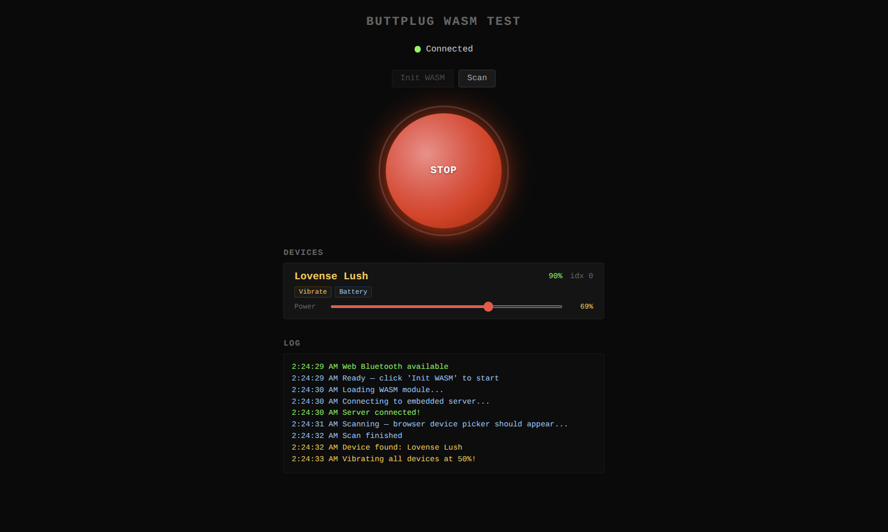

# @satvisorcom/buttplug

Fork of [buttplugio/buttplug-js](https://github.com/buttplugio/buttplug-js) — updated to Buttplug protocol v4, Rust crate v9, with fixes for WASM/WebBluetooth in modern browsers.

Published as two packages on GitHub Packages:

| Package | Description |
|---------|-------------|
| `@satvisorcom/buttplug` | TypeScript/JS Buttplug client — connect to servers via WebSocket or embedded WASM |
| `@satvisorcom/buttplug-wasm` | WASM-compiled Rust Buttplug server with WebBluetooth — no external app needed |



## What changed from upstream

- **Rust `buttplug` crate**: 7.1.13 → 9.0.9
- **Protocol**: full v4 message support:
  - `ScalarCmd` / `LinearCmd` / `RotateCmd` (replaces removed `OutputCmd`)
  - `StopDeviceCmd` / `StopAllDevices` (replaces `StopCmd`)
  - `SensorReadCmd` / `SensorSubscribeCmd` / `SensorUnsubscribeCmd` (replaces `InputCmd`)
  - `SensorReading` response handling (replaces `InputReading`)
- **JS client**: DeviceAdded/DeviceRemoved handling, Rust↔JS feature format normalization, battery reading with auto-scaling
- **WASM connector**: bypasses broken JSON schema validator, uses direct serde deserialization
- **WebBluetooth**: loads full device config (643 BLE filters), fixed specifier caching, serialized GATT operations (no more concurrent BLE collisions)
- **Build**: wasm-pack bundler target, Vite plugins for `env.now` and `ws` stubs

## Installation

Configure npm to use GitHub Packages for the `@satvisorcom` scope:

```sh
echo "@satvisorcom:registry=https://npm.pkg.github.com" >> .npmrc
```

Then install:

```sh
# JS client only (for WebSocket connection to Intiface Central)
npm install @satvisorcom/buttplug

# Embedded WASM server (standalone, no external app)
npm install @satvisorcom/buttplug-wasm
```

## Quick start

### Embedded WASM (standalone)

```js
import { ButtplugClient, DeviceOutput } from '@satvisorcom/buttplug';
import { ButtplugWasmClientConnector } from '@satvisorcom/buttplug-wasm';

const client = new ButtplugClient('My App');
const connector = new ButtplugWasmClientConnector();

client.addListener('deviceadded', (device) => {
  console.log(`Found: ${device.name}`);
});

await client.connect(connector);
await client.startScanning();

// Later, vibrate all devices at 50%
for (const [, device] of client.devices) {
  await device.runOutput(DeviceOutput.Vibrate.percent(0.5));
}

// Read battery
const battery = await device.battery(); // 0.0 - 1.0
console.log(`Battery: ${Math.round(battery * 100)}%`);

// Stop
await client.stopAllDevices();
```

### WebSocket (with Intiface Central)

```js
import { ButtplugClient, ButtplugBrowserWebsocketClientConnector } from '@satvisorcom/buttplug';

const client = new ButtplugClient('My App');
const connector = new ButtplugBrowserWebsocketClientConnector('ws://127.0.0.1:12345');

await client.connect(connector);
await client.startScanning();
```

### Vite config

The WASM binary needs a shim for `env.now` (from the `instant` crate) and a browser stub for the `ws` Node module. Add this plugin to your `vite.config.js`:

```js
function buttplugWasmPlugin() {
  const VIRTUAL_ENV = '\0wasm-env';
  const VIRTUAL_WS = '\0stub-ws';
  return {
    name: 'buttplug-wasm-stubs',
    resolveId(id) {
      if (id === 'env') return VIRTUAL_ENV;
      if (id === 'ws') return VIRTUAL_WS;
    },
    load(id) {
      if (id === VIRTUAL_ENV) {
        return 'export function now() { return performance.now(); }';
      }
      if (id === VIRTUAL_WS) {
        return 'export const WebSocket = globalThis.WebSocket;';
      }
    },
  };
}
```

## Demo

A working demo app is included in `wasm/example/`. Features:

- WASM server init + BLE device scanning
- Per-device power slider with BLE-safe throttling
- Battery level readout and feature tags (Vibrate, Battery, etc.)
- Global GO/STOP button

### Running the demo

```sh
# 1. Build the WASM binary
cd wasm/rust
wasm-pack build --target bundler

# 2. Install dependencies and start dev server
cd ../example
npm install
npm run dev
```

The demo runs at `http://localhost:5177`.

### Web Bluetooth requirements

Web Bluetooth is required for device scanning. Browser support:

| Browser | Status |
|---------|--------|
| Chrome/Edge (Windows, macOS) | Works out of the box |
| Chrome/Edge (Linux) | Enable `chrome://flags/#enable-web-bluetooth` → relaunch |
| Firefox, Safari | Not supported |

HTTPS or `localhost` is required. The device picker needs a user gesture (button click).

Launch Chrome with the flag from CLI:

```sh
google-chrome --enable-features=WebBluetooth
```

## Development

```sh
# Install all workspace dependencies
npm install

# Build WASM binary
cd wasm/rust && wasm-pack build --target bundler && cd ../..

# Build JS client
npm run build --workspace=js

# Build WASM package
npm run build:web --workspace=wasm

# Run demo
cd wasm/example && npm run dev
```

## Publishing

Packages are published to GitHub Packages via CI. Push a version tag to trigger:

```sh
git tag v4.1.0
git push satvisorcom v4.1.0
```

Or use the manual workflow dispatch from the Actions tab.

## License

BSD 3-Clause — see [LICENSE](LICENSE) in the project root.
